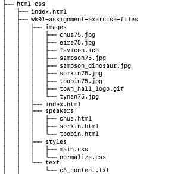

# Week 1 HTML/CSS Lab

## Competencies

Below are some of the competencies you will further develop and demonstrate through this assignment:

- Working with HTML and CSS in your chosen text editor
- HTML architecture
- Browser Testing
- Relative paths
- Character Entities
- Basic navigation
- Superscript text

## Overview

1. Pair Partner One (PP1) updates their local repo with any changes to the [Program Increment 1 HTML/CSS assignment repo](https://gitlab.mccinfo.net/code-school/course-work/pi1-html-css). (_Note: Pair Partner Two [PP2] may do the same, but it's not required for the assignment._)
1. PP1 updates their local GitHub Pages repos with any remote changes.
1. PP1 copies the directory "[wk01-assignment-exercise-files](wk01-assignment-exercise-files/)" from this week's assignment into their GitHub Pages project's `html-css/` folder so files in this repo look like the following:
    
    
    (_Note: The GitHub Pages repo should already have a pgae `html-css/index.html` with a link to `/wk01-assignment-exercise-files/index.html`. Susequent assignments will require students create this link in the GitHub Pages repo._)

1. Follow the instructions for Exercise 3-1 in _Murach's HTML5 and CSS3_, pages 120 - 122, with the following change:
    - For steps 1 and 2 on page 120, use `wk01-assignment-exercise-files/index.html` and `wk01-assignment-exercise-files/text/c3_content.txt`.
1. Follow steps 3 and following,  making commits when successfully completing each step.
1. At step 12 on page 122, the "driver" role should switch to Pair Partner Two (PP2).
1. PP1 updates the remote repository with their local changes.
1. PP2 updates their local files with upstream changes.
1. PP2 then starts on step 12 of the exercise in their environment.
1. When complete, PP2 updates the remote repository with their local changes.
1. PP2 makes a merge request (i.e. "pull request") in GitHub for PP1 to approve.
1. PP1 approves the request and merges the changes.
1. Both PP1 and PP2 should verify that their respective GitHub pages reflect the completed assignment.

## Rubric

This assignment will be assessed on:

- Completeness
- Formatting
