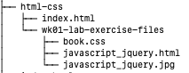

# Week 1 HTML/CSS Lab

## Competencies

Below are some of the competencies you will develop through this lab:

- Using a text editor
- Running an HTML/CSS page
- Validating and debugging HTML and CSS
- CSS
  - Float
  - Color
  - Font-size
  - IDs

## Overview

In this lab, you will be responsible for updating the CSS of an existing web page. After the styling is complete, you will cause errors throughout the document to see how the page responds and learn how to fix simple mistakes.

## Requirements

1. Pair Partner One (PP1) updates their local repo with any changes to the [Program Increment 1 HTML/CSS assignment repo](https://gitlab.mccinfo.net/code-school/course-work/pi1-html-css). (_Note: Pair Partner Two [PP2] may do the same, but it's not required for the assignmet._)
1. PP1 updates their local GitHub Pages repos with any remote changes.
1. PP1 copies the directory "[wk01-lab-exercise-files](wk01-lab-exercise-files/)" from this week's lab into their GitHub Pages project's `html-css/` folder so files in this repo look like the following:
    
    
    (_Note: The GitHub Pages repo should already have a page `html-css/index.html` with a link to `/wk01-lab-exercise-files/javascript_jquery.html`. Susequent labs will require students to create this link in the GitHub Pages repo._)
1. Follow the instructions for Exercise 2-2 in _Murach's HTML5 and CSS3_, page 84, with the following change:
    - Step 2: "Open this HTML file in your text editor:  `wk01-lab-exercise-files/javascript_jquery.html`.
1. Follow steps 3 and following,  making commits when successfully completing each step.
1. At step 8, the "driver" role should switch to Pair Partner Two (PP2).
1. PP1 updates the remote repository with their local changes.
1. PP2 updates their local files with upstream changes.
1. PP2 then starts on step 8 of the exercise in their environment.
1. When complete, PP2 updates the remote repository with their local changes.
1. PP2 makes a merge request (i.e. "pull request") in GitHub for PP1 to approve.
1. PP1 approves the request and merges the changes.
1. Both PP1 and PP2 should verify that their respective GitHub pages reflect the completed assignment.

## Solution tips

This is a relatively simple lab to let you get started familiarizing yourself with HTML and CSS. Take time to make sure you really understand the errors that are simulated in the exercise. Test out different functionality on your text editor such as hovering over a CSS color, class, or css/id pairing; shortcut keys; and editing multiple lines at once.

If you get done early, spend some time testing out the different combinations of ids and classes. Test the hierarchy of how the styling rules are followed and which order takes precedence in the CSS file.

You can also take this lab as an opportunity to find HTML and CSS plugins for your text editor.

Visual Studio Code:

- HTML Snippets
- Prettier - Code formatter
- IntelliSense for CSS class names in HTML
- Auto Rename Tag
- Auto Close Tag

