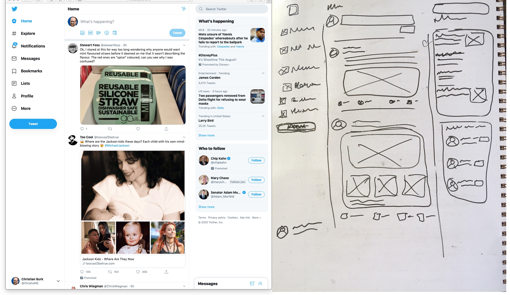
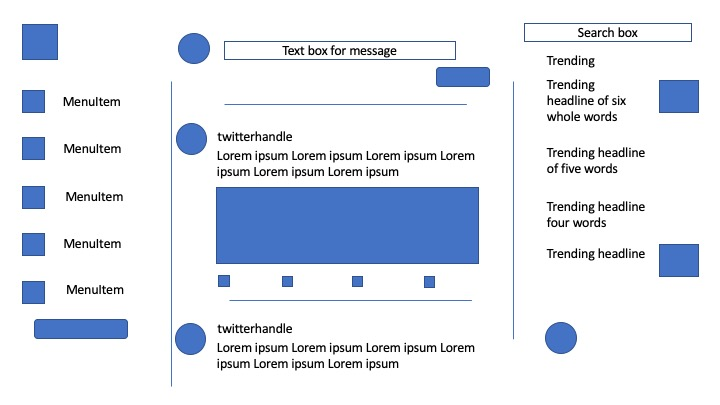

# Week 1 HCI/UI/ UX Introduction #1

## Competencies

Below are some of the competencies you will further develop and demonstrate through this assignment:

1. Basic knowledge of user experience
1. Examples of "good" and "bad" websites
1. How to make a wireframe

## Website examples

### Side menu examples
- https://austinkleon.com/
- http://www.suzannecollinsbooks.com/works.htm

### Campaign site (huh?)
- https://therealgorv.com/

## Activity
### Reverse-engineering a Twitter Wireframe
Using this [Twitter screenshot](screenshot-twitter.png), each student will create a wireframe in less than 10 minutes. 

The idea is to make a low-fidelity version of site for the purposes of showing the layout and components. It should follow the same level of detail as this example:

1. Take a picture of the wireframe
1. Send it to [cmburk@mccneb.edu](mailto:cmburk@mccneb.edu)

### Rubric
- Demonstrate the utility of a low-fidelity wireframe
- Select a level of detail to capture in a wireframe
- Quickly create a sketch for the purposes of discussion and discovery

### Wireframe Your Programming Pair Portfolio Home Page

Below is an overview of this exercise and what you must do to complete it:

1. Learn basics and background of user experience
1. Learn basics of what wireframing is and why it is used
1. Layout practice design
1. Start designing your portfolio landing page

Below are the details of what you must do to perform and submit this assignment:

1. As a programing pair, use [diagrams.net](https://app.diagrams.net/), PowerPoint or another simple drawing tool to create a digital low-fidelity wireframe of a home page design for your GitHub Pages site. 
1. When done, Pair Partner One (PP1) exports the design as a jpg or png
1. PP1 adds the image to your GitHub Pages repo in their local environment
1. PP1 updates the remote GitHub Pages repo
1. PP1 emails the url to to the image to [cmburk@mccneb.edu](mailto:cmburk@mccneb.edu)

#### Examples

Home Page:
![Low-fidelity digital wireframe]
(wireframe-digital-lo-fi-home-page-example.png)
(_Note: You don't need to show the browser toolbar in your wireframe._)

Twitter Wireframe Using PowerPoint:

## Rubric

Below are the primary criteria for how the quality and completeness of this assignment will be assessed:

1. Understand basics of UI/UX and be able to explain the differences
1. Practice using a digital drawing tool for wireframing
1. Design the first edition of your portfolio landing page

