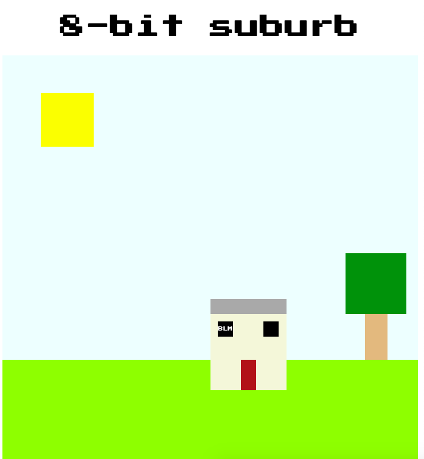

# Week 2 Overview
## Class 1
- Java (described elsewhere [_these are not the droids you're looking for_])

## Class 2 (Thurs., Sept 17)
### Agenda
| Activity | Led by | Type|
| ------------- | ------------- | ------------- |
| [Bell work](#bellwork) | Student | Classwork (before class starts) |
| Q/A | Instructor | Discussion |
| Knowledge check review | Instructor | Discussion |
| HTML/CSS Lab | Programming Pair | Classwork |
| HTML/CSS Assignment | Programming Pair | Classwork/Homework |
| Class wrap-up and next steps | Instructor | Discussion |

### Resources
- [HTML/CSS Student Preparation Plan](html-css-prep-plan.md)
- [HTML/CSS Lab](html-css-lab.md)
- [HTML/CSS Assignment](html-css-assignment.md)

#### Bell Work
(_Note: Bell work should be done individually while waiting for class to start, although you should feel free to ask your pairing partner for help or advice if you get stuck._)
In your local environment, make the HTML/CSS equivalent of this using the box model CSS you have learned.

