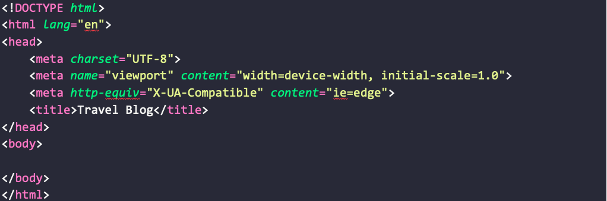

# Week 2 HTML/CSS Assignment

## Competencies

Below are some of the competencies you will further develop and demonstrate through this assignment:

- Set up the project structure of an HTML project
- Add Bootstrap safely to your project
- Learn to read Bootstrap documentation
- Implement complex items using Bootstrap classes
- Responsive web design
- Linking images from an external folder
- Use an external stylesheet

## Overview

Below is an overview of this assignment and what you must do to complete it:

This is assignment will take you through the process of programming with unfamiliar tools. For the purposes of this exercise, we will be using the Bootstrap CSS framework. The concepts of this assignment can be applied to all unfamiliar programming, whether it is a new language, framework, or tool. The current development ecosystem is very friendly to new learners. There is a huge breadth of tutorials, examples, and documentation for almost all the development tools that you will use. When you are tasked with learning a new language, framework, plugin, etc. just follow these steps:

1. Google it!
    1. Be as specific as you can
    1. Sometimes results that aren't quite right can give you hints on how to change your search
1. Look at the documentation and find an example that is the closest to your vision
1. Copy the example into your code
1. Swap example content with your own
1. Personalize the styling

## Set up the project

(_Note: Before beginning, follow the pair programming processes from Week 1's [lab](https://gitlab.mccinfo.net/code-school/course-work/pi1-html-css/-/blob/master/week-01/html-css-lab.md) and [assignment](https://gitlab.mccinfo.net/code-school/course-work/pi1-html-css/-/blob/master/week-01/html-css-assignment.md), updating your assignment and GitHub Pages repos. As you work, be sure to switch driver and navigator roles throughout the assignment._)

1. Create a directory in `html-css\` of your GitHub pages repo called `wk02-bootstrap-example\`.
3. Add a file called `index.html`
4. Create the following directories:
    - assets/imgs
    - assets/css
    - assets/js

Your project directory structure should look like this:


## Add Bootstrap to the project
This implementation adds Bootstrap by adding Bootstrap's files into our project structure rather than using a CDN. If you are not familiar with the trade-offs between the two options, here are some articles addressing the benefits and issues of both.

- [https://www.sitepoint.com/7-reasons-not-to-use-a-cdn/](https://www.sitepoint.com/7-reasons-not-to-use-a-cdn/)
- [https://www.keycdn.com/blog/why-use-a-cdn](https://www.keycdn.com/blog/why-use-a-cdn)

You may notice that some of the points discussed in the articles are contradictory to each other. This shows how complicated and nuanced this issue can be, so make sure you fully understand your priorities for a new project every time you are making this decision. For the sake of this exercise, we will be using the direct file strategy.

1. Download Bootstrap from: [https://getbootstrap.com/docs/4.5/getting-started/download/#compiled-css-and-js](https://getbootstrap.com/docs/4.5/getting-started/download/#compiled-css-and-js)
    - Use the download button underneath Compiled CSS and JS
1. Unzip the files
1. Copy the `bootstrap-x.x.x-dist/js/bootstrap.bundle.min.js` file into your project's assets/js directory.
1. Copy the `bootstrap-x.x.x-dist/css/bootstrap.min.css` file into your project's assets/js directory
1. Add jQuery to the project
    1. Go to [https://code.jquery.com/jquery-3.5.1.min.js](https://code.jquery.com/jquery-3.5.1.min.js)
    1. Copy the contents into a file called: `assets/js/jquery.min.js`

Your project directory should now look like this:


## Create the project structure in index.html

1. Use Visual Studio Code's auto complete to set up the basic HTML5 structure or get some practice with typing HTML by using the following screenshot as a guide for `index.html`.


1. Above the title tag, add the scripts and stylesheet in this order:
```
<script src="assets/js/jquery.min.js"></script>
<script src="assets/js/bootstrap.bundle.min.js"></script>
<link rel="stylesheet" href="assets/css/bootstrap.min.css">
```

## Familiarize yourself with the basics of Bootstrap 

Read the following information to understand how Bootstrap handles layout styling.

1. [https://getbootstrap.com/docs/4.5/layout/overview/](https://getbootstrap.com/docs/4.0/layout/overview/) (We will mainly use the container section)
1. [https://getbootstrap.com/docs/4.0/layout/grid/](https://getbootstrap.com/docs/4.0/layout/grid/) (Read all section up to "No Gutters")
- Pay special attention to how Bootstrap uses a 12 column structure to give you the most flexibility in widths
- Complementary combinations can be 1x12, 2x6, 3x4, 4x3, 6x2, and 12x1
- You can also do any mix of to create incomplet column width combinations (3 width and 8 width, for example)

## Add a carousel as the header

Bootstrap projects always start with a container as their outermost element. If you don't have a container it can break the way that classes and components look and work.
1. Inside the body tag, put a `div` with the `container-fluid` class. (_Note: `container-fluid` will make it so that our carousel can reach the edges of the page._)
1. Inside the new container, add a `div` of class `row`.
1. Go to [https://getbootstrap.com/docs/4.5/components/carousel/](https://getbootstrap.com/docs/4.5/components/carousel/)
1. Copy the code form the example "With Indicators"
1. Add it inside your new row
1. Download 3 pictures from [https://www.pexels.com](https://www.pexels.com/)
    1. Use the "Large" setting so that the files aren't unnecessarily huge
    1. Add the files to your project's imgs folder
    1. Link the pictures to the carousel item's `img` tag
1. The carousel decides its height based on the height of the images, so we will have to add some custom CSS
    1. Create a main.css file in your project's css directory
    1. Link the new stylesheet underneath the Bootstrap stylesheet in index.html
    1. Inside main.css add:
    ```
    .carousel-item {
      max-height:500px;
      }
      ```

If all of your files and Bootstrap are linked effectively, your project should look something like this:


## Add the basic quote section

1. Add a `div` with class `row` under the carousel row
1. Inside the row, add a `div` with classes `col-12` and `quote`
    - `col-12` is from Bootstrap's [grid styling](https://getbootstrap.com/docs/4.5/layout/grid/)
    - `quote` is what we will use to style the text and spacing
1. \*\*BONUS\*\* Get a font that you like from [Google Fonts](https://fonts.google.com) and implement it by following their instructions.
1. Inside your `quote` `div` add an `h3` tag with a [quotation](https://www.rasmussen.edu/degrees/technology/blog/technology-quotes-to-inspire-you-today/) that is meaningful to you.
1. In the main.css file, add styling for class `quote`
    - Center the text
    - Set proper margins

## How to add Bootstrap components that are new to you

You are tasked with creating another section that has 3 cards describing different modes of transportation that can be used while traveling.

1. Google "Bootstrap Cards"
1. The first result is from Bootstrap
1. Following this result will take you to the official documentation, complete with examples.
1. In this case, the first example looks like what I am looking for, so I will start by preparing the row
    1. Create a new `div` with class `row` underneath the quote row
    1. Add 3 `div` tags inside the new row with class `col-md-4`
        - This will prepare the row to house 3 cards
    1. Go back to the Bootstrap example and copy the first card example into the new columns
    1. Get rid of the button from the bottom of the cards
    1. Add class `card-section` inside the class attribute of your row and manipulate it using `main.css`
      1. Give the row proper padding
      1. Add a background
          - You don't want to add the background you choose to every card-section that you create, so set an `id="transportation"` for this row
          - A [themed color](https://flatuicolors.com/) is the simplest choice.
          - \*\*BONUS\*\* Try using a [duotone](https://duotone.shapefactory.co/) for an interesting background, but be very careful with your color choice so that it doesn't take away from your content.
    1. Swap all of the example content with your own
    1. Finalize the styling and spacing
        1. Adjust any default styling that you don't like about the Bootstrap example
        1. Test the spacing of your cards on different screens and find a good balance
    1. In the end, you should have something that resembles this:


## Add a list element
Practice add the Bootstrap list element on your own. The general rule is to just follow the same simple process that we used in the first few sections:

1. Google the component
1. Look at the Bootstrap documentation and find an example that is the closest to your vision
1. Copy the example into your code
1. Swap example content with your own
1. Personalize the styling

_Hint: The browser dev tools are your friend! Use the inspect elements tool to find what bootstrap classes you will be overwriting and test out unfamiliar css attributes._

This is the list section you are tasked with making (with your own text, of course):


Each category needs to have a different description that pops up when you select the location. Read the documentation carefully and lean heavily on the examples you find.

## Make it responsive

The website currently handles mobile view very poorly. Bootstrap's grid structure lets developers set different column counts for different screen sizes using its sm, md, and lg notation. This can also be applied to padding and margins. Follow the documentation for Bootstrap's layout functionality and make the website viewable on a phone.

The purpose of this exercise is to use Bootstrap's classes, so you will be downgraded if you use @media queries instead.

_Hint: You may have to convert some of your custom CSS into Bootstrap spacing classes_

1. [Spacing documentation](https://getbootstrap.com/docs/4.5/utilities/spacing/) 
2. [Layout documentation](https://getbootstrap.com/docs/4.5/layout/overview/) 
3. [Grid documentation](https://getbootstrap.com/docs/4.5/layout/grid/) 

## Make sure your code is pretty

Add comments into your HTML to show the separation of the sections and make it more readable. Try and get your CSS classes grouped in a way that makes sense and comment the sections that they affect. Format your HTML and CSS (use the automatic formatting functionality that you can get for your text editor)

## Done Early? Just can't get enough!?

Use this opportunity to make your portfolio pretty! Add Bootstrap to the index.html file of your portfolio using the CDN and see what you can do to give it better design. You can experiment with all kinds of lists, cards, headers, and more.

- Follow the [Bootstrap Quick Start](https://getbootstrap.com/docs/4.5/getting-started/introduction/) instructions.

## Requirements

Below are the details of what you must do to perform and submit this assignment:

1. Follow all of the steps above
1. Add the Bootstrap page created to your GitHub Pages repo with a link to it in your `<username>.github.io/html-css/index.html`
1. Be sure to commit and push your progress after every major section
1. Switch driver and navigator roles at least once
1. Contact the instructor team to review your work and provide feedback

## Rubric

Below are the primary criteria for how the quality and completeness of this assignment will be assessed:

1. All tasks are completed
1. Sections are styled properly
1. Code is formatted and includes helpful comments
1. Complete project is uploaded to the repository
1. Project is in the proper structure
