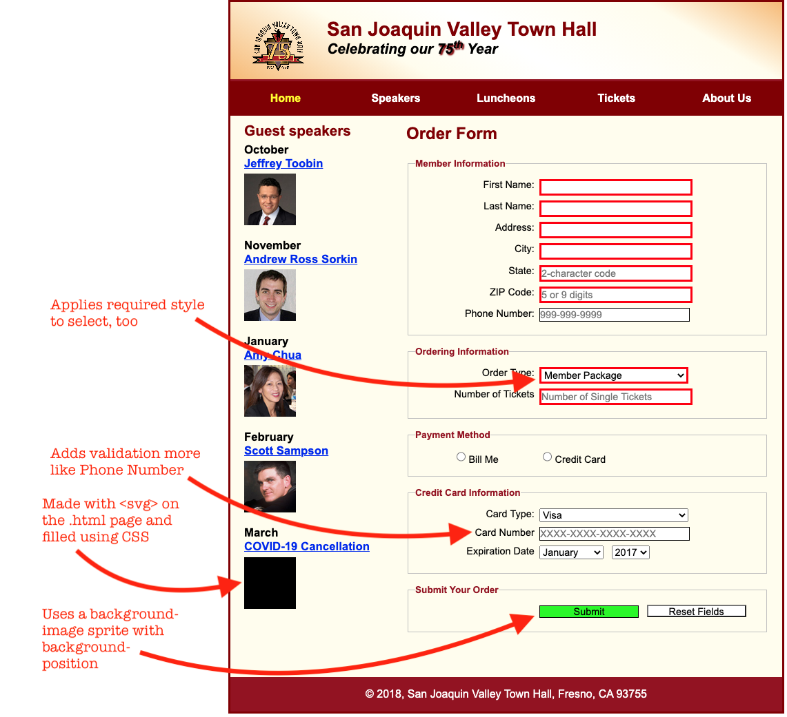

# Week 6 HTML/CSS Assignment

## Competencies

Below are some of the competencies you will further develop and demonstrate through this assignment:

- Adding form elements
- Making form elements required
- Adding form validation
- Making elements change based on user activity
- Using SVG
- Using sprites for rollover effects
- Using CSS animation
- Using CSS transform

## Overview

Below is an overview of this lab and what you must do to complete it:
- Exercise 13-1

1. Pair Partner One (PP1) updates their local repo with any changes to the [Program Increment 1 HTML/CSS assignment repo](https://gitlab.mccinfo.net/code-school/course-work/pi1-html-css). (_Note: Pair Partner Two [PP2] may do the same, but it's not required for the assignmet._)
1. PP1 updates their local GitHub Pages repos with any remote changes.
1. PP1 copies the directory "wk06-assignment-exercise-files" from this week's lab into their GitHub Pages project's `html-css/` folder.
1. PP1 creates a link to `html-css/wk06-assignment-exercise-files/tickets.html` on  `html-css/index.html`
1. Follow the instructions for Exercise 13-1 in _Murach's HTML5 and CSS3_, page 502 - 503, with the following changes:
    - For step 1 on page 502, use `wk06-assignment-exercise-files/tickets.html` and `wk06-assignment-exercise-files/styles/tickets.css`.
1. **Additionally, you will be required to add/change the following:**
    1. Add an SVG on the .html page in place of an additional speaker image (as shown) (see [CSS tricks](https://css-tricks.com/using-svg/) on how to do this)
    1. Use CSS to fill the SVG (as shown)
    1. Change the credit card placeholder and validation (as shown)
    1. Add a hover effect on the submit button using a sprite and background-positioning (as shown)
    1. Add some effect (using CSS "transform", "transition" and among other styles) to the input fields when they are in focus (as shown)
    1. Add some effect (using CSS animations) on the text inputs when the "reset" class is assigned to them, which happens when the "reset" button is pressed (see the Javascript at the beginning of the "tickets.html" to learn more).

1. Follow steps 2 and following, making commits when changes are successfully made at each step.
1. Don't forget to switch "driver" and "navigator" roles.
1. Don't forget to push to GitHub pages to test.
1. Both PP1 and PP2 should verify that their respective GitHub pages reflect the completed assignment.

### Screenshot of assignment with requested changes

### Screenshot of assignment with with user interactions

### Screen capture of an example animation based on the Reset button

## Requirements

Below are the details of what you must do to perform and submit this assignment:

- Complete all instructions for Exercise 13-1, found on page 502 of the Murach HTML and CSS book.
- Complete steps 6.1 - 6.6 above
- Push your final project to GitHub Pages

## Rubric

Below are the primary criteria for how the quality and completeness of this assignment will be assessed:

You will be assessed on completeness and use of best practices for HTML and CSS.

## Bonus

Make the form more semantic, by changing the "Number of tickets" to use a number with a minimum and maximum value.
Replace any repeated values (colors, sizes, fonts) with [custom properties](https://developer.mozilla.org/en-US/docs/Web/CSS/Using_CSS_custom_properties)

